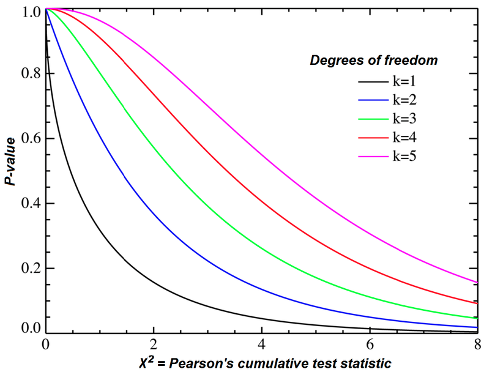

In this lab, we will learn about hypothesis testing using the Chi-Square distribution. This distribution is commonly used when analyzing categorical data. In this lab, we will use the R programming language to conduct a Chi-Square test. 

### Load Packages

```{r load-packages, message=FALSE}

library(tidyverse)
library(stats)
library(kableExtra)
library(knitr)
library(hrbrthemes)

```

### The Data

Suppose we are interested in examining whether or not a certain trait in a population is evenly distributed among different categories. To investigate this, we collect data on the trait of interest for a random sample of individuals from each category. In our example, we have data on the number of individuals with brown, blue, green, and hazel eyes, and we want to know if these individuals differ significantly in the proportion of individuals with brown hair.

```{r load-data}
trait_data <- tibble(
  eye_color = c("Brown", "Blue", "Green", "Hazel"),
  yes_brown_hair = c(150, 10,65, 80),
  no_brown_hair = c(101, 48, 75, 32)
)


kable(
trait_data,
    "html") %>% 
  kable_styling(font_size = 10,
                "striped") %>% 
  scroll_box(width="100%")


```

In this example, the `yes_brown_hair` column gives the number of individuals in each category with the trait of interest, while the `no_brown_hair` column gives the number of individuals in each category without the trait of interest.

```{r}

trait_data %>% 
  pivot_longer(names_to = "hair",
               cols = c('yes_brown_hair', 'no_brown_hair'),
               ) %>% 
  ggplot() +
  aes(x = eye_color, y= value, fill = hair) +
  geom_bar(stat = "identity", position = "fill") +
  theme_ipsum()

```


### Chi-Square Test

To test if the distribution of the trait of interest is even across the different categories, we will use the Chi-Square goodness-of-fit test. The null hypothesis is that the trait is evenly distributed among the different categories, while the alternative hypothesis is that there is a difference in the distribution of the trait among categories.

### Formula

$$\chi^2 = \Sigma\frac{(O-E)^2}{E}$$
  
O = observed frequency and E=expected frequency.
  
If the null hypothesis is true, the observed and expected frequencies will be close in value and the χ2 statistic will be close to zero. If the null hypothesis is false, then the χ2 statistic will be large. Critical values can be found in a table of probabilities for the χ2 distribution (i.e. https://www.math.arizona.edu/~jwatkins/chi-square-table.pdf) or they can be found using the functions bellow! The decision rule is as follows: Reject H0 if χ2 > critical value of the the test statistic OR p-value < significance level (e.g. 0.05 or 0.01)
  
We can conduct the Chi-Square test using the `chisq.test()` function in R. The function takes as input the observed values of the trait of interest (i.e. no_brown_hair) and their expected probabilities, which are the counts that we would expect if the trait was distributed equally to the reference sample (i.e. each eye colour sample in yes_brown_hair divided by the total of yes_brown_hair).

  
```{r chisq}

# total per yes /no brown hair category

total_yes_brown_hair <- sum(trait_data$yes_brown_hair)
total_no_brown_hair <- sum(trait_data$no_brown_hair)

# proportion within each yes / no category with eye colour blue, hazel, brown, green

prop_yes_brown_hair <- trait_data$yes_brown_hair / total_yes_brown_hair
prop_no_brown_hair <- trait_data$no_brown_hair / total_no_brown_hair

# use taking yes brown hair as proportion reference

chisq.test(x = trait_data$no_brown_hair, p = prop_yes_brown_hair)

```
<center>


</center>
  
The output of the `chisq.test()` function gives us the test statistic and the p-value for the Chi-Square test. In our example, the test statistic is 217.88 and the p-value is < 2.2e-16. Since the p-value is less than 0.05, we reject the null hypothesis and conclude that there is evidence of a difference in the distribution of the trait of interest among categories.

### Second Example: Iris

Since there is only one categorical variable and the Chi-square test of independence requires two categorical variables, we add the variable size which corresponds to small if the length of the petal is smaller than the median of all flowers, big otherwise:

```{r}

dat <- iris

dat$size <- ifelse(dat$Sepal.Length < median(dat$Sepal.Length),
  "small", "big"
)

kable(
dat %>% 
  head,
"html") %>% 
  kable_styling(font_size = 10,
                "striped") %>% 
  scroll_box(width="100%")

```


The null hypothesis would be that there's an even distribution of species of flowers with big and small sepal length. The alternate hypothesis states that there is a difference in the distribution of these categories. We now create a contingency table of the two variables Species and size with the table() function to explore this further:

```{r}

ct <- table(dat$Species, dat$size)

kable(
ct,
    "html") %>% 
  kable_styling(font_size = 10,
                "striped") %>% 
  scroll_box(width="100%")

```

Visualise the data:

```{r}

ggplot(dat) +
  aes(x = Species, fill = size) +
  geom_bar(position = "fill") + 
  theme_ipsum()

```

Test if there is a relationship between the variables Species and size:

```{r}
test <- chisq.test(table(dat$Species, dat$size))
test
```
p-value < 2.2e-16 so we reject the null hypothesis which states that species distribute equally in the small and long sepal length categories and we say we have gathered enough evidence to say that there is a statistically significant difference between the two distributions of categories. 
